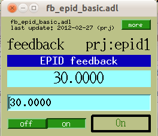
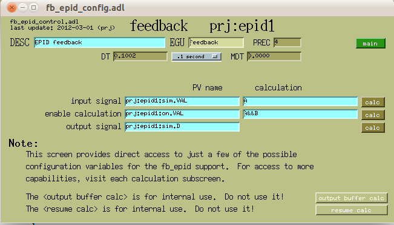
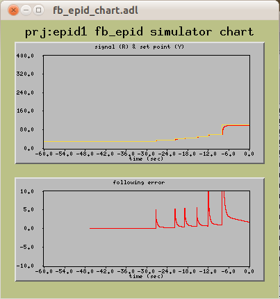

.. $Id: index.rst 14555 2012-03-02 20:21:10Z jemian $
   .
   cmd>  rst2html -s -d index.{rst,html}

========================================================
EPICS ``fb_epid`` feedback controls
========================================================

=========== ================================================================
**Purpose** use the EPICS epid [#epid]_ record for generic software feedback
**Author**  Pete R. Jemian
**SVN**     $Id: index.rst 14555 2012-03-02 20:21:10Z jemian $
=========== ================================================================

.. sectnum::

.. contents::

.. sidebar:: About ...

   This simulator is part of the ``fb_epid`` support in 
   the synApps optics [#optics]_ module.

Overview
-----------------

The ``fb_epid`` support provides a database centered around the EPICS
``epid`` [#epid]_ record.
The versatility of the ``fb_epid`` support lies in the 
various calculations that can be reconfigured by the user 
while the IOC is operating.
These calculations allow the user to configure the input and output
of the PID loop, as well as to apply complex conditions on when the 
PID loop should be allowed to drive the output or be switched off.

The ``fb_epid`` support is part of the synApps [#synApps]_
optics [#optics]_ module.

Theory of operation
++++++++++++++++++++++

#. A signal is provided as an EPICS process variable (macro parameter IN). 
   The signal source can be in the same IOC with the feedback 
   software or in another EPICS IOC available on the network.
   The variable should be a floating point.  (In principle, it
   *could* be an integer but the feedback may not be so smooth.)
#. The input calculation (swait record) provides some 
   flexibility for conditioning the input signal to the feedback.
#. An epid record provides real-time feedback and 
   recalculate the output variable.
#. The output from the epid record is buffered by the ``obuf``
   calculation which watches the Feedback ON (FBON) switch 
   and retains the previous output value if the feedback 
   software is switched off.
#. The output calculation allows some flexibility 
   for conditioning the output signal to the positioner (OUT). 
   The conditioned epid result is pushed to the positioner.
#. A positioner responds to the result from the epid record 
   and thus further modifies the input signal.
#. The feedback can be switched on manually or automatically, 
   subject to the logic of some other calculation (CALC). 
   For example, a shutter closed signal could suspend feedback. 
   In this case, the output is not driven.
#. When the feedback is switched on, the positioner should 
   not jerk to a different position. The feedback software 
   must be prepared to start moving the positioner from 
   its present location.

Installation
-----------------

Install one instance of this database for each feedback channel. 
If two different methods for feedback are desired for a given axis, 
create two instances of this database. 
See below for details of these configurations.

  Clever adjustments to the ``enable`` calculations can allow
  for automated switching, if that is desired.
  For example, at APS beam line 33ID for feedback of the DCM crystal 2 PZT, 
  one instance would use the XBPM *y* position signal 
  while another instance would use the D3 graphite foil intensity 
  as input signals.  Both would be configured to drive the DCM
  second crystal PZT.  Choice of the *active* ``fb_epid`` instance 
  was obtained by adding values to the ``enable`` calculation,
  watching the FBON field of the other feedback.  

Follow these steps to install the ``fb_epid`` support:

#. `modify the st.cmd file`_
#. `add fb_epid.substitutions file`_
#. `modify auto_settings.req file`_
#. `add configuration to GUI to access the new support`_

.. _modify the st.cmd file:

modify the IOC's ``st.cmd`` file
++++++++++++++++++++++++++++++++++++++

To install this software, make changes in the IOC's ``st.cmd`` file,
adding this line anywhere between the calls to 
``dbLoadDatabase`` and ``iocInit``::

   ### PID_based feedback
   dbLoadTemplate("fb_epid.substitutions")

.. _add fb_epid.substitutions file: 

add ``fb_epid.substitutions`` file
++++++++++++++++++++++++++++++++++++++

Create the ``fb_epid.substitutions`` file in the same 
directory as ``st.cmd`` with content such as:

.. include:: ../../iocBoot/iocAny/fb_epid.substitutions
   :literal:

Macro substitutions in the fb_epid.db file
~~~~~~~~~~~~~~~~~~~~~~~~~~~~~~~~~~~~~~~~~~~~~

There are several macro substitutions in the 
``fb_epid`` support database (``fb_epid.db``) to simplify its installation .

==============	=======================================================
macro		description
==============	=======================================================
``$(P)``	Prefix for this instance of this database. 
                Note that ``$(P):in.INAN`` holds PV name of 
		input PV (by default)
``$(IN)``	PV name: input signal
``$(OUT)``	PV name: output positioner
``$(MODE)``	either ``PID`` or ``Max/Min``
``$(CALC)``	string: actual calculation to go in 
		``$(P):enable.CALC``, 
		
		* 1=feedback on
		* 0=feedback off
		
		A trivial value might be "``A``" which only 
		watches the value of ``$(P):on``.
``$(PERMIT1)``	PV name: boolean value to permit operations; 
		value becomes ``$(P):enable.B``
``$(PERMIT2)``	PV name: boolean value to permit operations; 
		value becomes ``$(P):enable.C``
``$(PERMIT3)``	PV name: boolean value to permit operations; 
		value becomes ``$(P):enable.D``
``$(PERMIT4)``	PV name: boolean value to permit operations; 
		value becomes ``$(P):enable.E``
==============	=======================================================

.. _modify auto_settings.req file:

modify ``auto_settings.req`` file
++++++++++++++++++++++++++++++++++++++

To ensure that changed values will be restored after reboot,
add lines such as this to the ``auto_settings.req`` file 
(usually found in the same directory with the ``st.cmd`` file).

::

  ### PID_based feedback
  file fb_epid.req P=$(P)epid1

.. _add configuration to GUI to access the new support:

add configuration to GUI to access the new support
++++++++++++++++++++++++++++++++++++++++++++++++++++++

Add commands to the GUI displays to call each configured 
instance of the ``fb_epid`` support.  Such as this *related display*
widget in MEDM::

   "related display" {
   	   object {
   		   x=10
   		   y=10
   		   width=70
   		   height=20
   	   }
   	   display[0] {
   		   label="fb_epid"
   		   name="fb_epid.adl"
   		   args="P=prj:epid1"
   	   }
   	   display[1] {
   		   label="simulator"
   		   name="fb_epid_sim.adl"
   		   args="P=prj:epid1,C=sim"
   	   }
   	   clr=0
   	   bclr=17
   	   label="-prj:epid1"
   }

Or start MEDM using a command line such as::

    medm -x -macro "P=prj:epid1" fb_epid.adl &

Macro substitutions in the ``fb_epid.adl`` file
~~~~~~~~~~~~~~~~~~~~~~~~~~~~~~~~~~~~~~~~~~~~~~~~~~~

For the MEDM provided, the macro substitutions are:

========  ====================================
macro	  description
========  ====================================
``$(P)``  Prefix for this instance of support.
========  ====================================

Use
-----------------

Once the software has been installed (IOC configured with 
database and autosave/restore configured to retain settings 
across restarts of the IOC), some careful setup needs to happen 
before the software is ready to be used.

First, it is necessary to identify the EPICS PVs for the 
control variable (such as a positioner or the power to a 
heating element) and the signal variable (the PV that is 
sampled for the PID loop). These may have been configured 
in the IOC but it is possible to change them while the 
IOC is running. They can be changed without need to recompile 
or restart the EPICS IOC.

To avoid any unexpected consequences, be sure the ``fb_epid``
software is switched off before changing any PVs or changing 
between modes of operation. In the MEDM screen, in the EPID 
output section, press the button marked off.

It is most important to make sure that the input signal is 
updated faster than the recalculation interval for the ``fb_epid``
software or instability will occur. A factor of 3 to 10 input 
updates per output update is reasonable. The output will be 
updated each time the epid is processed.

MEDM screens
++++++++++++++++++

The features of the ``fb_epid`` software are accessed
from the main control screen in MEDM: ``fb_epid.adl``.
Controls for the Simulator_ are provided from a 
``fb_epid_sim.adl`` screen.

``fb_epid`` main control screen
~~~~~~~~~~~~~~~~~~~~~~~~~~~~~~~~~~~~~

The MEDM screen provides access to all the controls of the 
epid [#epid]_ record. To add some flexibility for configuration 
at run time by beam line users, an EPICS interface database 
has been created. The user can change the input variable(s) 
through a calculation (swait [#swait]_ record). 

.. figure:: fb_epid_adl.png
   :alt: main MEDM control screen

   Figure: Main ``fb_epid`` control screen

Control of the output variable will be permitted between 
the software limits shown at the bottom of the control screen. 
From the output calc, it is possible to change the PV which 
will be directed by this database.

The enable calculation can be used to provide automated on/off 
features with details specific to the particular installation.

``fb_epid`` basic control screen
~~~~~~~~~~~~~~~~~~~~~~~~~~~~~~~~~~~~~ 

There are many controls on the main screen.  For routine
operations, it may be more desirable to display just
the basic controls (and less of
the tuning infrastructure).

   Figure: Basic ``fb_epid`` control screen

``fb_epid`` configuration screen
~~~~~~~~~~~~~~~~~~~~~~~~~~~~~~~~~~~~~ 

The configuration screen provides top-level
access to the main components that must be addressed
for basic configuration.
Note that advanced situations must use the calculation screens
to access the complete interfaces of the swait records.

   Figure: ``fb_epid`` configuration screen

.. caution::
   The buttons marked *output buffer calc* and
   *resume calc* in the lower right corner are for 
   internal use only.  
   **Do not change anything on these screens.**

``fb_epid`` chart screen
~~~~~~~~~~~~~~~~~~~~~~~~~~~~~~~~~~~~~ 

The chart screen provides a view to the recent progress.
There are two strip charts (value v. time).
The upper chart shows the set point (.VAL)
and current value (.CVAL).
The lower chart shows the following error (.ERR).

.. note::
   The limits on the two charts need to be set 
   before this screen is of any real use.
   Right-click and select "PV limits" from the pop-up menu.
   Don't forget to apply any changes.

   Figure: ``fb_epid`` configuration screen

``fb_epid`` simulator control screen
~~~~~~~~~~~~~~~~~~~~~~~~~~~~~~~~~~~~~

The main control screen for the Simulator_ is shown:

.. figure:: fb_epid_sim_adl.png
   :alt: main MEDM control screen for simulator

   Figure: ``fb_epid`` temperature simulator controls

Setup of the calculations
++++++++++++++++++++++++++++++++++++++

As stated above,
the versatility of the ``fb_epid`` support lies in the 
various calculations that can be reconfigured by the user 
while the IOC is operating.

Setting the enable calculation
~~~~~~~~~~~~~~~~~~~~~~~~~~~~~~~~~~~~~

The operation of ``fb_epid`` is permitted when the 
result of the enable calculation is 1.0. The first, 
obvious, choice is that bo record is provided to the 
user to switch the ``fb_epid`` software on and off. 
But the software should also disable itself when the 
input signal goes out of range or also due to 
some other operating parameters.

  Other factors can be built into the enable calculation.
  For example, on undulator beam lines, it is not useful
  to run the feedback if the undulator is not operating
  (gap is closed or magnets are energized). In such a case,
  monitor the PV for the undulator gap (APS undulator A)
  and enable only if the gap is below some reasonable
  number such as 50 mm.

One should also factor the ``fb_epid`` input signal into 
the enable calculation by checking that is within a valid 
operating range. 

Setting the input calculation
~~~~~~~~~~~~~~~~~~~~~~~~~~~~~~~~~~~~~

It is possible to perform limited math on the input signal 
to be used. For example, when the goal is to maximize the 
conductance through a crystal pair, such as a monochromator, 
the best signal would be a ratio between detector immediately 
before and after the pair of crystals. The control variable 
would be the rotation angle of either of the two crystals 
(usually a fine rotation of the second crystal). The input 
calculation would then monitor the PVs for both detectors 
and calculate the ratio of the two: A/B. In this example, 
it would also be useful to include the PV of this calculation 
in the enable calculation and ensure that the ratio is acceptable.

Setting the limits on the output
~~~~~~~~~~~~~~~~~~~~~~~~~~~~~~~~~~~~~

To prevent the epid record from driving the control variable 
out of bounds, there are limits for low and high (using the 
epid record's .DRVL and .DRVH field). The epid record software 
will not allow the positioner to drive outside of these limits. 

Tuning of the epid record
++++++++++++++++++++++++++++++++++++++

In the ``epid`` record documentation [#epid]_,
there is a special discussion on feedback tuning in PID mode.
Refer to the documentation for more information on the 
EPICS ``epid`` record.

The epid record can run in either Max/Min or PID mode. 
Max/Min is used to maximize a positive input signal or 
minimize a negative input signal such as from a beam 
line detector. PID mode is used to keep the input signal 
at constant value such as holding a sample's temperature constant. 

Max/Min mode
~~~~~~~~~~~~~~~~~~~~~~~~~~~~~~~~~~~~~

Max/Min mode is useful for monochromator feedback or 
other situations where a positive signal is to be maximized 
(or a negative signal is to be minimized). The online epid 
record documentation is lacking details about this mode 
so one is referred to inspecting the source code [#epid_source]_. 

.. note:: In Max/Min mode, the Set Point is ignored.

PID mode
~~~~~~~~~~~~~~~~~~~~~~~~~~~~~~~~~~~~~

PID mode is useful for holding the input signal to the 
*Set Point* by adjusting the control variable. 
The epid record documentation provides a good description 
of how to set the PID constants.

Example using the simulator
++++++++++++++++++++++++++++++++++++++

An example demonstrating the simulator is provided in the
`simulator documentation <simulator.html>`_.

Example DCM feedback from X-ray Beam Position Monitor
++++++++++++++++++++++++++++++++++++++++++++++++++++++++++++++++++

Consider the case of an X-ray beam line with a double crystal 
monochromator (DCM) and an X-ray Beam Position Monitor (XBPM) 
after the DCM.  The XBPM provides a signal that can be used 
to maintain the throughput of the DCM if the DCM allows an adjustment 
of either first or second crystal Bragg rotation independent of 
the other crystal.

For synchrotron beam lines, the vertical position from the XBPM 
provides the input signal to the epid loop.  The DCM often has a
piezoelectric transducer (PZT) that is used to control the fine rotation
of the second crystal.  The second crystal rotation is controlled
by a low voltage (such as -2 .. +9 VDC) sent to the PZT's amplifier.
(The purpose of this amplifier is to supply the operating voltage to the
PZT and optionally account for the hysteresis of the PZT as used 
in positioner applications.)

This example shows the startup configuration used to maintain
the XBPM vertical beam position by controlling the DCM second 
crystal PZT voltage.

========   ================================   ========================================
macro	   configured value		      meaning
========   ================================   ========================================
P	   ``iad:fbe:xbpm:y``		      PV of this ``fb_epid`` instance
IN	   ``iad:xbpm:pos:y``		      Y position from the XBPM
OUT	   ``iad:540:c0:out0``		      control voltage of the PZT
MODE	   ``PID``				      hold position steady using PID
CALC	   ``A&&B&&C``			      only when EPID is ON and both permits
PERMIT1    ``iad:beamAvailable.VAL``	      require X-ray beam to be ready
PERMIT2    ``iad:xbpm:current:ok.VAL``	      require XBPM signal to be valid
PERMIT3 				      unused
PERMIT4 				      unused
========   ================================   ========================================

Example Monochromator feedback from beam intensity monitor
++++++++++++++++++++++++++++++++++++++++++++++++++++++++++++++++++

Consider another beam line with a DCM and then a monitor of the beam
intensity (reported as a floating-point or large integer number).  
A list of suitable such monitors might include ionization chambers 
graphite foils, or fluorescent materials with photodiodes.

========   ===========================  ========================================
macro	   configured value		meaning
========   ===========================  ========================================
P	   ``iad:fbe:D3:y``		PV of this ``fb_epid`` instance
IN	   ``iad:540:c0:in10``		signal from the beam intensity monitor
OUT	   ``iad:540:c0:out0``		control voltage of the PZT
MODE	   ``Max/Min``			maximize beam intensity
CALC	   ``A&&B``			only when EPID is ON and one permit
PERMIT1    ``iad:beamAvailable.VAL``	require X-ray beam to be ready
PERMIT2 				unused
PERMIT3 				unused
PERMIT4 				unused
========   ===========================  ========================================

Previous observations During Initial Development
++++++++++++++++++++++++++++++++++++++++++++++++++++

Notes from the early stages of development show motivations for
the construction of this database support.

#. `Notes from initial epid record testing in 2004-06 <tests/index.html>`_
#. `Early notes on the fb_epid support from 2004-06 <docv1.html>`_

Infrastructure
-----------------

The ``fb_epid`` support consists of several components:

=========================================  ===================================
file                                       description
=========================================  ===================================
``opticsApp/Db/fb_epid.db``		   EPICS database
``opticsApp/Db/fb_epid.req``		   request file for autosave/restore
``opticsApp/Db/epid.req``		   request file for autosave/restore
``iocBoot/iocAny/fb_epid.substitutions``   creates specific instances
``opticsApp/op/adl/fb_epid.adl``	   main MEDM screen
``opticsApp/op/adl/fb_epid_basic.adl``	   basic MEDM screen
``opticsApp/op/adl/fb_epid_chart.adl``	   charts VAL and CVAL, also ERR
``opticsApp/op/adl/fb_epid_config.adl``    simplified configuration screen
``opticsApp/op/adl/fb_epid_sim.adl``	   simulator controls
``documentation/fb_epid/index.html``	   documentation
=========================================  ===================================

Structure of the EPICS Database
++++++++++++++++++++++++++++++++

The EPICS database was constructed in 2004.  
The records of the database are defined in this table:

===========  ===============  ================================================
record type  name             description
===========  ===============  ================================================
epid	     ``$(P)``	      Epid record instance
swait	     ``$(P):in``      Input signal collector
swait	     ``$(P):obuf``    Enforces ``$(P).FBON`` to disconnect epid 
                              record from output so ``$(OUT)`` is not changed
swait	     ``$(P):out``     Output signal collector
sseq	     ``$(P):outpv``   Part of bumpless start feature
swait	     ``$(P):resume``  Part of bumpless start feature
bo	     ``$(P):on``      User switch to turn epid ON or OFF
swait	     ``$(P):enable``  Automatic ON/OFF feature
swait	     ``$(P):sim``     Simulated temperature reading and heater
===========  ===============  ================================================

A figure was produced to show how these records are connected.
Note that the simulator record (``$(P):sim``)is not shown in this figure.

.. figure:: fb_epid.png
   :width: 90%
   :alt: structure of fb_epid database

   Figure: Structure of the ``fb_epid`` database

The database file has many comments.  The text of the file is included here:

.. include:: ../../opticsApp/Db/fb_epid.db
   :literal:

Simulator
++++++++++++++++++++++++++++++++

To help learn how to use the ``fb_epid`` support, an swait 
record was added to simulate the temperature reading of an object
that is exposed to some cooling power.  A heater with adjustable power
may applied, either as adjustable power or as a switched power.

Documentation of the simulator is provided on a `related page <simulator.html>`_.

.. rubric:: Footnotes

.. [#calc]     EPICS calc Record:	    http://www.aps.anl.gov/bcda/synApps/calc/calcDocs.html
.. [#epid]     EPICS epid Record:	    http://cars9.uchicago.edu/software/epics/epidRecord.html
.. [#epid_source] epid source code:         https://subversion.xor.aps.anl.gov/trac/synApps/browser/std/trunk/stdApp/src/devEpidSoft.c
.. [#optics]   EPICS synApps optics module: http://www.aps.anl.gov/bcda/synApps/optics/opticsDocs.html
.. [#swait]    EPICS swait Record:	    http://www.aps.anl.gov/bcda/synApps/calc/swaitRecord.html
.. [#synApps]  EPICS synApps:		    http://www.aps.anl.gov/bcda/synApps
